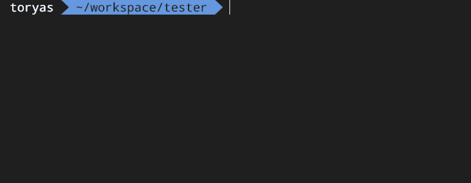
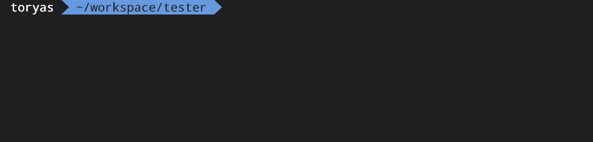

# Serverless CF Parameters

Serverless plugin to set CloudFormation Parameters.

## Install

1. run `npm install --sade-dev serverless-cf-parameters`
2. add **serverless-cf-parameters** in serverless.yml plugin section
    ```yml
    plugins:
        - serverless-cf-parameters
    ```

Whit this plugin you have 2 ways to set Parameters.

## Interactive mode

When you run deploy or package, the plugin find Parameters in `resources` section from `serverless.yml` file. 

Then then plugin ask for these parameters to define the values ​​for them.



## Parameters in JSON

When you run deploy or package pass `--cf-parameters` flag and the JOSN path with the values for parameters.



an example:

this is your serverless.yml

```yml
#...

resources:
    Parameters:
        MyParameter:
            Type: String
            MinLength: 3
            MaxLength: 63
            AllowedPattern: "([a-zA-Z0-9]){1}([a-zA-Z0-9-])*"
        OtherParameter:
            Type: String
            MinLength: 3
            MaxLength: 63
            AllowedPattern: "([a-zA-Z0-9]){1}([a-zA-Z0-9-])*"

#...

```

your json file with parameters config looks like this:

```json
{
    "MyParameter":"value for MyParameter",
    "OtherParameter":"value for OtherParameter"
}
```